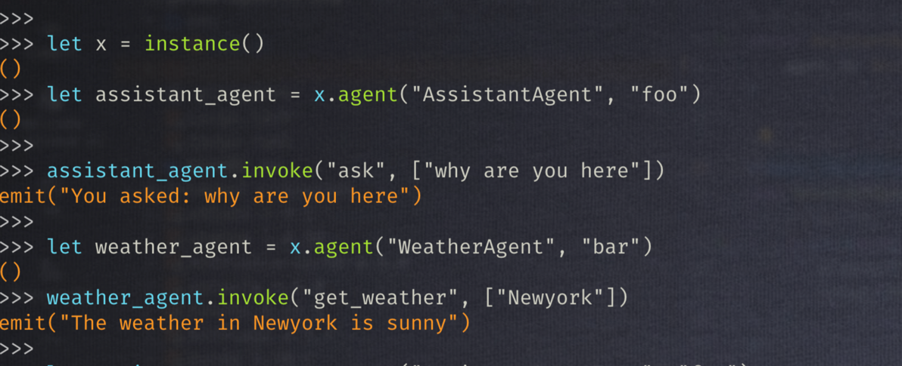

# golem-agentic

golem-agentic allows you to write AI agents and non-agentic workers in golem with zero knowledge in WIT.

**Designed with AI in mind:** dynamic agent and method discovery, plus plug‑and‑play support for MCP etc are examples. 
In short, the tooling, data types and corresponding APIs to develop AI apps are first‑class citizens.

While dynamic in nature to satisfy AI protocols, users can write **type-safe** code.

This is _**NOT**_ automatic WIT generation based on user code. This implies, we disallow leaking anything about WIT into user's development flow


## Build

```shell
cargo build
```

Refer to [golem-agentic-examples](https://github.com/golemcloud/golem-agentic-examples) repo.
These examples will become templates in golem-cli soon.

## Test

Currently testing is done using low level APIs through Rib. This will get better soon




## TODO (to be made as tickets)
* Currently tested with just string arguments,. Make sure paramerter types and return types talks proper WitType , and implement proper mapping between WitType and argument types.
* Make sure external interactions look like typesafe rpc calls when interactiing with agents - meaning golem repl shouldn't talk low level WITs. This should be possible if typesafe rpc is possible. Multiple   suggestions exist such as custom_section, adapter etc. There were a few time consuming parts but confident external interactions such as from REPL can be typesafe, if RPC is already proven to be typesafe.
* Make sure [code_first_agent](https://github.com/golemcloud/golem/compare/main...code_first_agent) branch in golem OSS is merged into OSS. golem-wit changes and implementation already exist here. Some integration tests already exist in this branch.
* Make sure agents can exist in different modules within a workspace and can exist as different workers.
* Integrate with Golem CLI and template these examples
* Incrementally add AI specific types into the root WIT. We can break this into multiple tickets.
